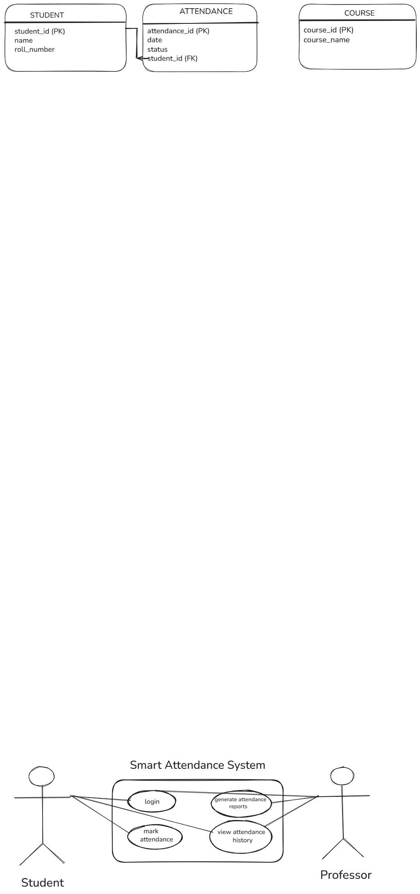

# Project Design: Use Case Diagram

This diagram shows how different users (Students and Professors) interact with the Smart Attendance System.

## 2. Entity Relationship Diagram (ERD)
This diagram represents the database structure, showing how students connect to their attendance status.

